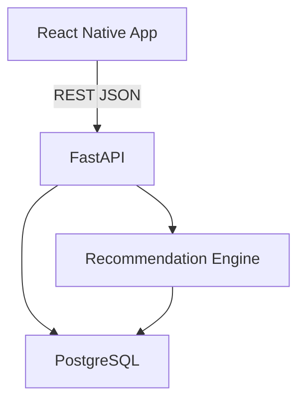

# UnderNight

UnderNight es una aplicacion movil para ayudar a grupos de amigos a decidir donde salir considerando presupuesto individual, preferencias musicales, ambiente, ubicacion, traslado y horarios.

## Arquitectura



El monorepo separa la aplicacion movil (`apps/mobile`), la API (`apps/api`) y la infraestructura (`infrastructure`). La comunicacion entre mobile y backend es REST con JSON.

## Documentacion del MVP

- [Informe tecnico y funcional](docs/mvp-report.md)
- [Diagramas de arquitectura](docs/diagrams.md)

## Requisitos

- Docker y Docker Compose.
- Node.js 20 o superior.
- npm.
- Python 3.12 si ejecutas la API sin Docker.
- Expo Go para probar en un dispositivo fisico.

## Configuracion

```bash
cp .env.example .env
```

Variables principales:

- `DATABASE_URL`: URL SQLAlchemy para PostgreSQL.
- `CORS_ORIGINS`: origenes permitidos para Expo y desarrollo local.
- `EXPO_PUBLIC_API_URL`: URL del backend consumida por la app movil.

## Backend y PostgreSQL

Levantar servicios:

```bash
make up
```

La API queda disponible en [http://localhost:8000](http://localhost:8000) y Swagger en [http://localhost:8000/docs](http://localhost:8000/docs).

Detener:

```bash
make down
```

Ver logs:

```bash
make logs
```

## Migraciones

El contenedor de la API ejecuta `alembic upgrade head` antes de iniciar. Tambien puedes correrlo manualmente:

```bash
make migrate
```

Crear una migracion:

```bash
make migration name="describe_change"
```

## Datos de Prueba

Despues de levantar PostgreSQL y aplicar migraciones:

```bash
make seed
```

El seed carga nueve lugares ficticios y un plan de demostracion con cuatro participantes.

## App Movil

Instalar dependencias:

```bash
make mobile-install
```

Iniciar Expo:

```bash
make mobile-start
```

Para probar desde un dispositivo fisico, asegurate de que `EXPO_PUBLIC_API_URL` apunte a una URL alcanzable desde el telefono. En vez de `localhost`, usa la IP local de tu computador, por ejemplo `http://192.168.1.10:8000`.

## Tests y Linters

```bash
make test
make lint
make format
```

Los tests iniciales cubren health check, creacion de plan, creacion de participante, venues, recomendaciones y penalizacion por presupuesto.

## Limitaciones Actuales

- No hay login, invitaciones reales, chat, pagos ni reservas.
- La app movil guarda el formulario inicial solo en estado local.
- Las recomendaciones usan reglas deterministicas simples.
- Los costos de transporte son estimaciones fijas por zona y tipo de traslado.
- El catalogo de lugares es ficticio y controlado.

## Proximos Pasos

- Persistir planes creados desde la app movil en la API.
- Completar cuestionario de participantes.
- Agregar filtros por restricciones obligatorias.
- Mejorar explicaciones del ranking.
- Agregar pantalla de detalle con costos por participante.
- Preparar una futura capa de inteligencia artificial sin mezclarla con las reglas deterministicas.
