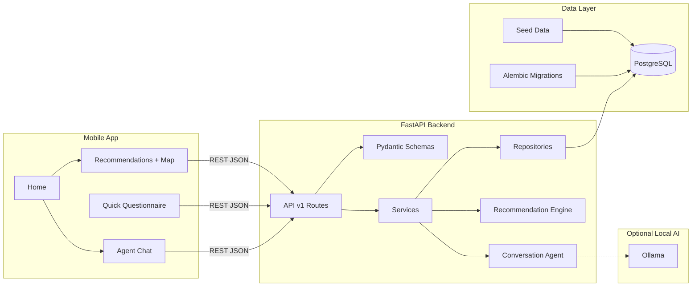
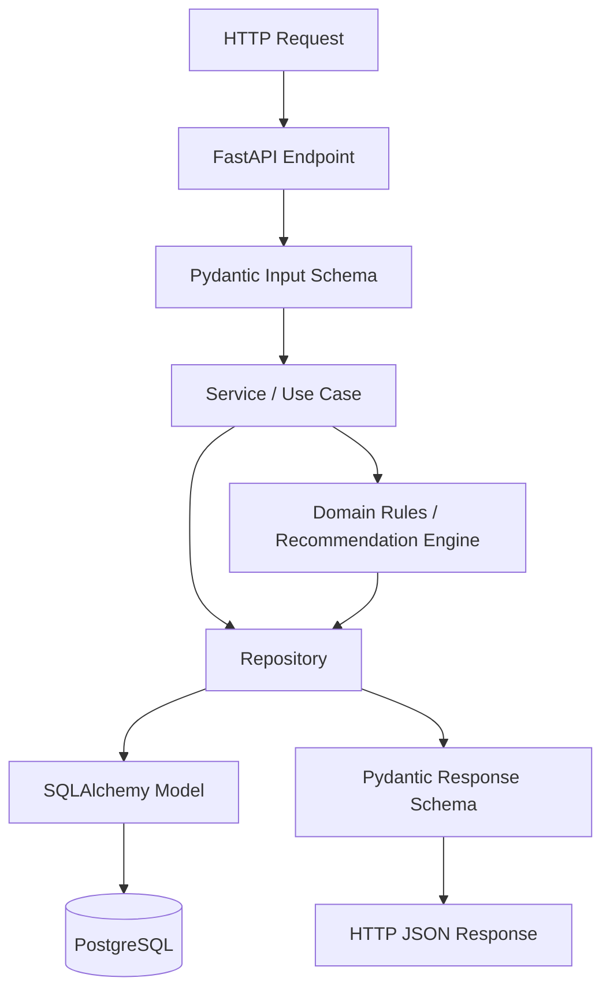
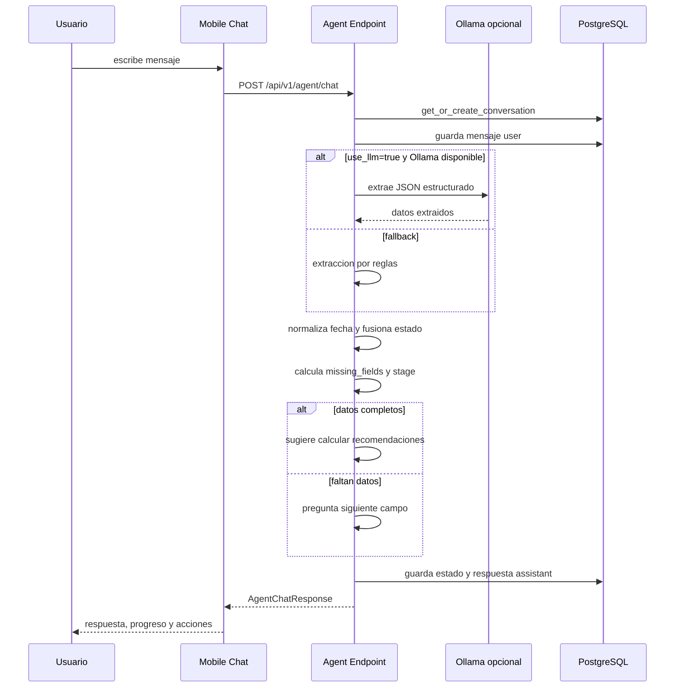
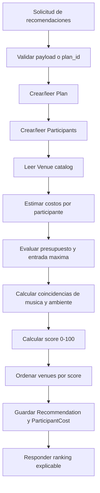
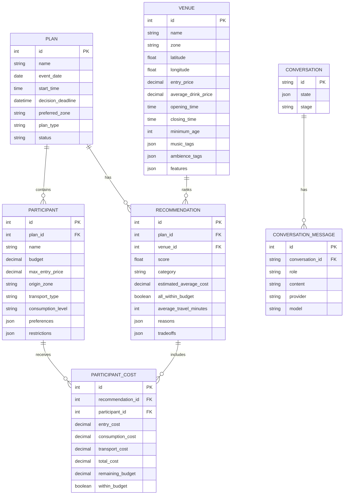
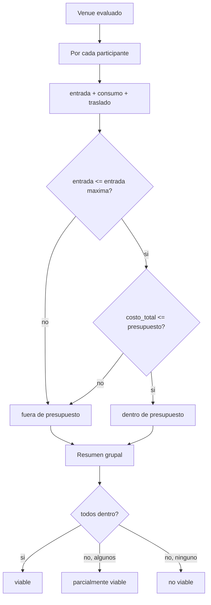

# Diagramas de arquitectura

Este archivo contiene diagramas Mermaid listos para pegar en Markdown, Notion, GitHub, presentaciones compatibles o herramientas como Mermaid Live Editor.

## 1. Arquitectura de alto nivel



## 2. Capas del backend



## 3. Flujo conversacional



## 4. Flujo de recomendaciones



## 5. Modelo entidad-relacion



## 6. Arquitectura de despliegue local

```mermaid
flowchart LR
    Dev[Developer Machine] --> Expo[Expo Dev Server]
    Dev --> Compose[Docker Compose]
    Compose --> API[API Container]
    Compose --> Postgres[(Postgres Container)]
    API --> Postgres
    API -. host.docker.internal:11434 .-> Ollama[Ollama local]
    Phone[Expo Go / Simulator] -->|EXPO_PUBLIC_API_URL| API
```

## 7. Decision tree de viabilidad


