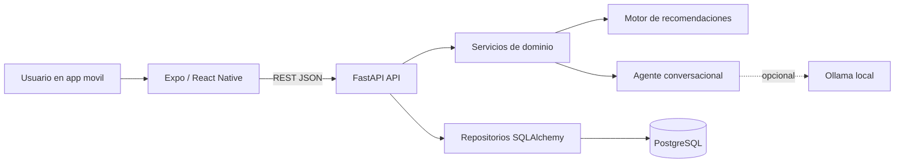
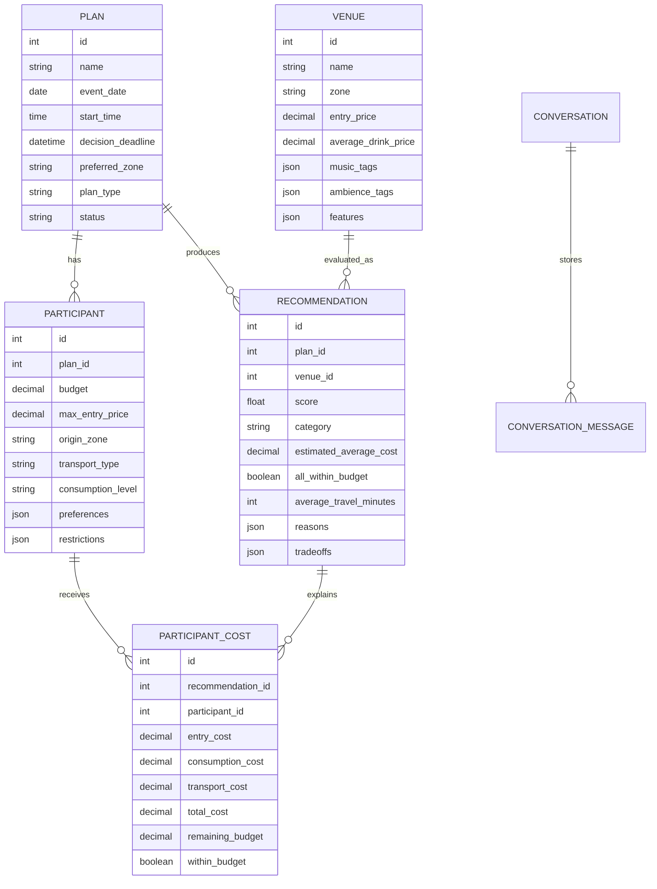
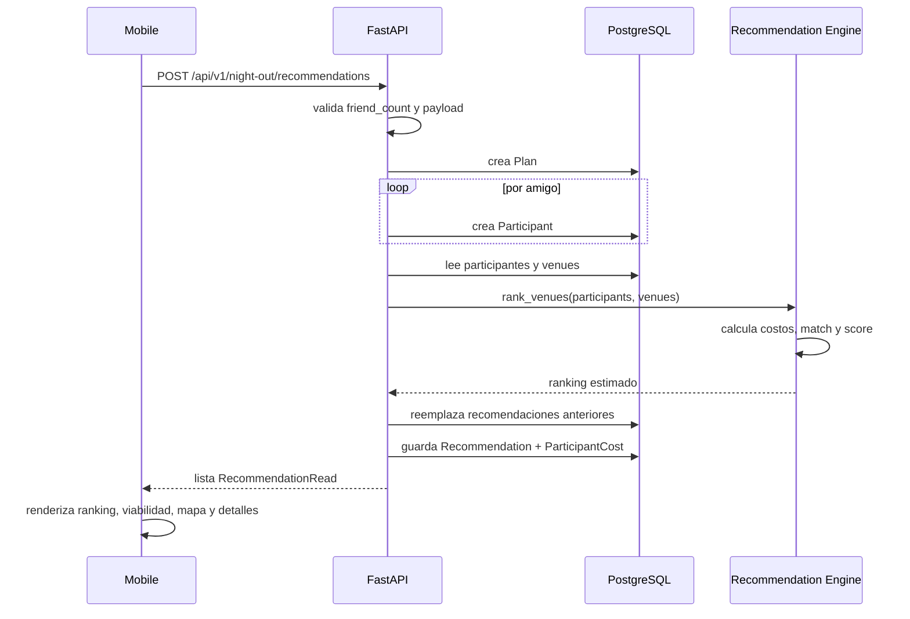
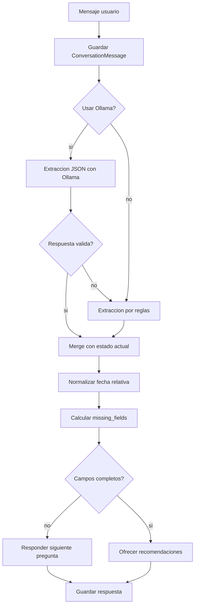

# UnderNight MVP - Informe tecnico y funcional

## 1. Resumen ejecutivo

UnderNight es un MVP de aplicacion movil para ayudar a grupos de amigos a decidir donde salir de noche. El producto cruza presupuesto individual, preferencias musicales, tipo de ambiente, zona de origen, medio de transporte y catalogo de lugares para entregar un ranking explicable.

El MVP combina dos experiencias:

- Un asistente conversacional que recopila datos base del grupo.
- Un flujo deterministico de recomendaciones que calcula compatibilidad, costos y trade-offs por lugar.

La decision final sigue siendo humana: UnderNight no reserva, no compra entradas y no reemplaza la evaluacion del grupo. Su valor esta en ordenar la informacion que normalmente queda dispersa entre chats, presupuestos y gustos personales.

## 2. Problema que resuelve

Organizar una salida grupal suele fallar por fricciones simples:

- Cada persona tiene presupuesto distinto.
- No todos salen desde la misma zona.
- El costo real no es solo la entrada: tambien incluye consumo y traslado.
- Los gustos de musica y ambiente no siempre coinciden.
- La comparacion de lugares suele ser manual y poco transparente.

UnderNight transforma esas variables en un ranking con explicaciones, permitiendo ver que opcion es viable, cual queda justa y que sacrificios implican las alternativas.

## 3. Alcance del MVP

Incluido:

- App mobile con Expo y React Native.
- Backend REST con FastAPI.
- Persistencia en PostgreSQL.
- Migraciones con Alembic.
- Catalogo controlado de venues de demostracion.
- Motor de recomendaciones por reglas.
- Calculo de costo por participante.
- Vista de recomendaciones con viabilidad, detalles y mapa.
- Asistente conversacional con estado persistido.
- Integracion opcional con Ollama para extraccion/respuesta conversacional.
- Fallback por reglas cuando no se usa LLM o falla Ollama.
- Tests backend para endpoints, motor, fechas y conversacion.

Fuera de alcance actual:

- Login y perfiles de usuario.
- Invitaciones reales o grupos persistentes.
- Chat entre amigos.
- Reservas, pagos o compra de entradas.
- Integraciones externas de precios, transporte o disponibilidad.
- Catalogo real de venues.
- Optimizacion avanzada por restricciones duras.

## 4. Arquitectura general

El repositorio es un monorepo con separacion clara por capa:

- `apps/mobile`: aplicacion Expo/React Native.
- `apps/api`: API FastAPI, dominio, repositorios, servicios y migraciones.
- `docs`: documentacion tecnica y de producto.
- `infrastructure`: espacio reservado para Docker/proxy/despliegue.
- `docker-compose.yml`: PostgreSQL y API para desarrollo local.



La app mobile no calcula recomendaciones. Captura datos, llama al backend y renderiza la respuesta. La API concentra validacion, persistencia, reglas de negocio y generacion de ranking.

## 5. Componentes principales

### Mobile

Stack:

- Expo `51`.
- React Native `0.74`.
- Expo Router.
- TypeScript.
- TanStack Query.
- Zustand disponible para estado local.
- React Native Maps para mapas.
- Lucide React Native para iconos.

Pantallas relevantes:

- `app/index.tsx`: home, entrada al asistente y exploracion de lugares.
- `app/agent/chat.tsx`: asistente conversacional para recolectar datos del grupo.
- `app/plans/create.tsx`: cuestionario rapido estructurado.
- `app/recommendations/index.tsx`: ranking o mapa general de venues.

Cliente API:

- `src/api/client.ts` centraliza URL base, fetch, manejo de errores y timeout.
- `EXPO_PUBLIC_API_URL` define la URL del backend.
- Si no existe, intenta inferir la IP desde Expo y cae a `http://localhost:8000`.
- El chat usa timeout de `120000 ms` porque Ollama puede tardar.

### Backend

Stack:

- Python `3.12`.
- FastAPI.
- SQLAlchemy 2.
- Alembic.
- PostgreSQL.
- Pydantic Settings.
- HTTPX para llamar a Ollama.
- Pytest, Ruff y Mypy para calidad.

Capas:

- `app/api/v1/endpoints`: rutas REST.
- `app/schemas`: contratos Pydantic de entrada/salida.
- `app/models`: modelos SQLAlchemy.
- `app/repositories`: operaciones de persistencia.
- `app/services`: orquestacion de casos de uso.
- `app/recommendation`: reglas de costo y scoring.
- `app/core`: configuracion y sesion de base de datos.

## 6. Endpoints del MVP

| Metodo | Ruta | Proposito |
| --- | --- | --- |
| `GET` | `/health` | Health check global de la API. |
| `GET` | `/api/v1/health` | Health check versionado. |
| `GET` | `/api/v1/venues` | Lista todos los venues. |
| `GET` | `/api/v1/venues/{venue_id}` | Obtiene un venue por ID. |
| `POST` | `/api/v1/plans` | Crea un plan. |
| `GET` | `/api/v1/plans/{plan_id}` | Obtiene un plan. |
| `POST` | `/api/v1/plans/{plan_id}/participants` | Agrega participante a un plan. |
| `GET` | `/api/v1/plans/{plan_id}/participants` | Lista participantes del plan. |
| `POST` | `/api/v1/plans/{plan_id}/recommendations` | Genera ranking para un plan existente. |
| `GET` | `/api/v1/plans/{plan_id}/recommendations` | Lee recomendaciones persistidas. |
| `POST` | `/api/v1/night-out/recommendations` | Crea plan + participantes desde cuestionario y recomienda. |
| `GET` | `/api/v1/agent/health` | Health check del agente. |
| `GET` | `/api/v1/agent/chat/health` | Health check alternativo del chat. |
| `POST` | `/api/v1/agent/chat` | Procesa mensaje, actualiza estado conversacional y responde. |
| `GET` | `/api/v1/ollama/health` | Verifica disponibilidad de Ollama y modelos. |

## 7. Modelo de datos

Entidades:

- `Plan`: salida que el grupo quiere organizar.
- `Participant`: persona incluida en un plan.
- `Venue`: lugar disponible en el catalogo controlado.
- `Recommendation`: evaluacion de un venue para un plan.
- `ParticipantCost`: detalle del costo por persona dentro de una recomendacion.
- `Conversation`: estado persistido del asistente.
- `ConversationMessage`: historial de mensajes del asistente.



## 8. Motor de recomendaciones

El motor es deliberadamente deterministico para que el MVP sea auditable. No usa IA para rankear lugares.

Entrada:

- Participantes del plan.
- Catalogo de venues.
- Configuracion de consumo por nivel.
- Tablas base de costo y tiempo de traslado.

Calculo por participante:

```text
costo_total = entrada + consumo_estimado + transporte_estimado
```

Reglas:

- La entrada del venue debe ser menor o igual al maximo de entrada del participante.
- El costo total debe quedar dentro del presupuesto individual.
- El consumo estimado depende del nivel `low`, `medium`, `high` o `custom`.
- El transporte se estima por combinacion de zona origen, zona venue y tipo de transporte.
- Los minutos de viaje se estiman por origen y zona del venue.

Scoring:

```text
score = ratio_en_presupuesto * 65
      + asequibilidad_promedio * 19
      + bonus_preferencias
```

El bonus de preferencias suma coincidencias de musica y ambiente, con tope de 16 puntos. El score final queda limitado a 100.

Categorias:

- `best_fit`: score >= 80.
- `balanced`: score >= 60.
- `tradeoff`: score < 60.

Salida:

- Ranking ordenado por score.
- Costo promedio estimado.
- Tiempo promedio de traslado.
- Viabilidad grupal.
- Detalle por participante.
- Razones y trade-offs.

## 9. Flujo de recomendacion



## 10. Agente conversacional

El chat recopila datos base para planificar una salida. Persiste conversacion, mensajes y estado.

Campos que intenta completar:

- Cantidad de personas.
- Presupuesto por persona o presupuestos individuales.
- Fecha del evento.
- Zonas de origen o punto de encuentro.
- Tipo de salida.
- Preferencias musicales.
- Restricciones confirmadas.

Funcionamiento:

1. Mobile envia mensaje a `/api/v1/agent/chat`.
2. Backend crea o recupera `Conversation`.
3. Guarda el mensaje del usuario.
4. Extrae datos estructurados.
5. Normaliza fechas relativas cuando corresponde.
6. Fusiona lo nuevo con el estado previo.
7. Calcula campos faltantes y etapa.
8. Genera respuesta y acciones sugeridas.
9. Guarda la respuesta del asistente.

La extraccion puede usar Ollama si `use_llm=true` y `LLM_PROVIDER=ollama`. Si falla por timeout, error HTTP, error de red o respuesta invalida, el sistema usa fallback por reglas.



## 11. Flujo mobile

El flujo principal actual es:

1. Home muestra UnderNight y CTA `Iniciar salida`.
2. Usuario entra al chat.
3. Chat recopila datos y muestra progreso.
4. Cuando el estado esta listo, la app convierte el estado conversacional a `NightQuestionnaire`.
5. Mobile envia el cuestionario al endpoint agregado `/night-out/recommendations`.
6. Backend crea plan, participantes y recomendaciones.
7. Mobile navega a `/recommendations?planId=...`.
8. La pantalla lee recomendaciones persistidas y muestra ranking.

Existe ademas una ruta de exploracion:

1. Home -> `Recomendaciones de lugares`.
2. Mobile llama `/api/v1/venues`.
3. Se muestra un mapa general de venues demo, sin personalizacion.

## 12. Datos de demostracion

El seed crea un catalogo de venues ficticios con zonas, precios, musica, ambiente y atributos de demostracion. Tambien crea un plan de demo llamado `Cumple de demo` con cuatro participantes.

Venues destacados del seed:

- `Club Barrio Bajo`: opcion viable/economica en Oriente.
- `Patio Economico`: opcion economica en Centro.
- `Sala Reggaeton Prime`: alta compatibilidad, mayor costo.
- `Niebla Room`: opcion premium.
- `Ritmo Archivo`: datos menos recientes.
- `Clave 23`: edad minima mas alta.

Estos datos estan pensados para mostrar casos de ranking, viabilidad, sobrepresupuesto, trade-offs y calidad de datos.

## 13. Configuracion e infraestructura local

Variables principales:

- `DATABASE_URL`: conexion SQLAlchemy a PostgreSQL.
- `CORS_ORIGINS`: origenes permitidos para Expo/desarrollo.
- `EXPO_PUBLIC_API_URL`: URL consumida por mobile.
- `APP_TIMEZONE`: zona horaria para fechas relativas.
- `CONSUMPTION_UNITS_LOW`, `CONSUMPTION_UNITS_MEDIUM`, `CONSUMPTION_UNITS_HIGH`: multiplicadores de consumo.
- `LLM_PROVIDER`: proveedor conversacional, actualmente `ollama`.
- `OLLAMA_BASE_URL`: URL del servicio Ollama.
- `OLLAMA_MODEL`: modelo local, por defecto `qwen3:4b`.
- `OLLAMA_TIMEOUT_SECONDS`: timeout backend para Ollama.

Comandos:

- `make up`: levanta PostgreSQL y API con Docker Compose.
- `make down`: detiene servicios.
- `make migrate`: aplica migraciones.
- `make seed`: carga datos demo.
- `make test`: ejecuta tests backend.
- `make lint`: ejecuta Ruff/Mypy y lint mobile.
- `make mobile-install`: instala dependencias mobile.
- `make mobile-start`: inicia Expo.

## 14. Calidad y pruebas

Los tests cubren:

- Health check.
- Creacion y lectura de planes.
- Creacion y listado de participantes.
- Listado de venues.
- Generacion de recomendaciones.
- Detalle de costo por participante.
- Penalizacion de venue sobre presupuesto.
- Endpoint agregado de cuestionario.
- Normalizacion de fechas relativas.
- Extraccion conversacional por reglas.
- Confirmacion de restricciones.

Riesgos de cobertura:

- No hay pruebas end-to-end mobile.
- No hay tests visuales de mapas o navegacion Expo.
- La integracion real con Ollama depende del entorno local.
- No hay pruebas de carga ni concurrencia.

## 15. Decisiones tecnicas clave

- Ranking deterministico: permite explicar cada recomendacion y mantener control sobre restricciones.
- JSON en preferencias/restricciones/tags: acelera iteracion del cuestionario sin migraciones frecuentes.
- Repositorios separados: las rutas FastAPI delegan persistencia y mantienen endpoints delgados.
- Endpoint agregado `/night-out/recommendations`: reduce friccion mobile para el MVP, creando plan, participantes y ranking en una sola llamada.
- Fallback conversacional por reglas: el producto sigue funcionando aunque Ollama no este disponible.
- Conversacion persistida: permite mantener estado entre mensajes y no depender solo del historial enviado por mobile.

## 16. Limitaciones actuales

- El catalogo de venues es ficticio y controlado.
- Los precios y transportes son estimaciones estaticas.
- Las restricciones aun se recolectan, pero no filtran de forma estricta todos los venues.
- El estado conversacional se transforma a cuestionario con defaults: consumo medio, rideshare y entrada maxima derivada.
- No existe gestion de usuarios ni permisos.
- No hay actualizacion automatica de venues.
- No hay algoritmo de consenso grupal mas alla de presupuesto y preferencias agregadas.
- La infraestructura no incluye despliegue productivo ni Nginx activo.

## 17. Proximos pasos sugeridos

Producto:

- Agregar invitaciones reales por link.
- Guardar grupos frecuentes.
- Permitir que cada participante complete su propio cuestionario.
- Separar restricciones duras de preferencias blandas.
- Mostrar explicaciones mas accionables: "si suben presupuesto en X, se abre Y".

Tecnico:

- Crear endpoint que convierta directamente `ConversationState` en `Plan` sin pasar por defaults mobile.
- Incorporar filtros obligatorios antes del scoring.
- Versionar el algoritmo de recomendacion.
- Agregar pruebas e2e mobile/API.
- Agregar observabilidad basica para llamadas al agente.
- Preparar pipeline de despliegue y variables por ambiente.

Datos:

- Reemplazar seed ficticio por un catalogo curado.
- Agregar fuente de actualizacion de precios y horarios.
- Medir confianza/calidad por venue.
- Mejorar transporte con distancias reales o APIs externas.

## 18. Mensaje para presentacion

UnderNight no intenta "adivinar" la mejor noche: organiza las restricciones reales del grupo y muestra opciones comparables. El MVP demuestra que, con datos simples y reglas explicables, es posible reducir la friccion de decidir donde salir, mostrar costos por persona y dejar claro que trade-offs tiene cada alternativa.
